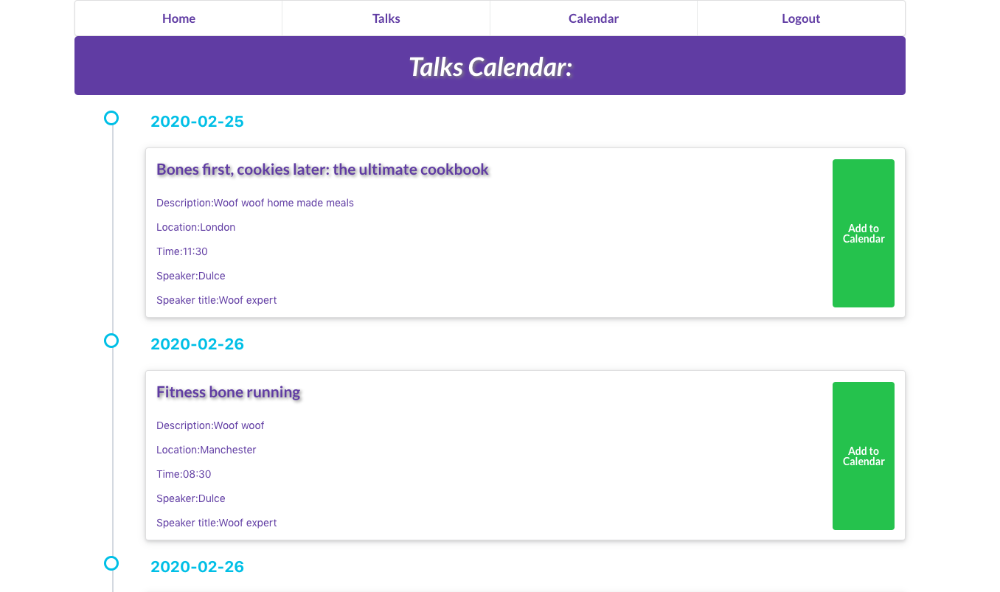
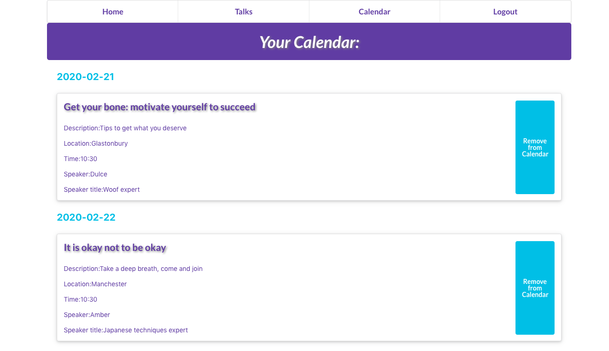

# 💻 Dulce Calendar Web App (BETA)

Web application to help you built a conference schedule. This project was bootstrapped with [Create React App](https://github.com/facebook/create-react-app).

## 🔨 Tools
- Node.js
- React
- React-DOM
- React-Create-App
- Redux
- Npm
- CSS
- ES6

## :trophy: Special Credits

Design idea by [Ibrahim Shaqura on Behance](https://www.behance.net/gallery/71179603/HCIE-App-UIUX-Design).

## ✨ Live Demo

You can look at it [here](https://intense-garden-00658.herokuapp.com/) and sign up or try it with the demo user: 
👤  User: dulce@woof.com
:lock: Password: 123456

## 🚀 Getting Started

To get a local copy up and running follow these simple example steps.

### Requirements

- Latest version of **[NodeJS](https://nodejs.org/en/)** _-- (npm included)_.

### Setup

- Download the repository.
- Checkout to **development** branch.
- In your terminal, run `npm install` to load all the necessary dependencies.
- If running locally, please replace the heroku url in all redux actions for localhost.
- Run `npm start` to launch the app.

## :pencil2: Todo
- [Testing](https://github.com/misselliev/dulce-calendar-redux/issues/6)

## Author

👤 Elizabeth Villalejos

- [Github](https://github.com/misselliev)
- [Linkedin](https://linkedin.com/ellievillalejos)
- [Dev.to](https://dev.to/misselliev)
- [Twitter](https://twitter.com/miss_elliev/)
- [Instagram](https://www.instagram.com/miss_elliev/)
- [Email](mailto:elizabeth.villalejos@gmail.com?subject=Website%20Inquiry)

## 🤝 Contributing

Contributions, issues and feature requests are welcome!

Feel free to check the [issues page](issues/).

## Show your support

Give a ⭐️ if you like this project!

> “What simple action could you take today to produce a new momentum toward success in your life?” Tony Robbins
